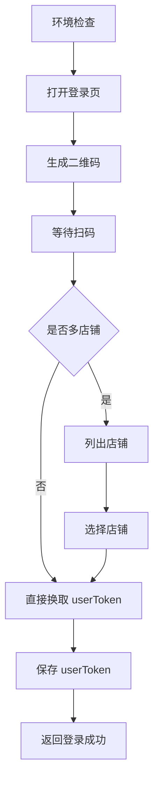

# 登录能力

## 作用

登录是所有开放能力的前置条件。

任何需要调用易奢堂开放 API 的能力，在真正执行前都必须先完成：

1. 扫码登录
2. 选店
3. 获取最终 `userToken`

## workflow

1. 环境检查
2. 打开登录页并生成二维码
3. 等待用户扫码
4. 如存在多店铺，列出店铺并选店
5. 保存最终 `userToken`
6. 返回当前登录状态

## flow

### Step 1: 环境检查

- 确认本地 Node、npm、jq、Playwright 和 Chromium 可用
- 如果依赖缺失，先执行 `./scripts/install-check.sh`

### Step 2: 打开登录页并生成二维码

- 使用 `./scripts/login.sh` 或 `./scripts/tool-call.sh login_flow`
- 生成二维码后等待用户扫码

### Step 3: 选店并保存 `userToken`

- 如果扫码账号存在多店铺，先列出店铺并让用户选择
- 选店后换取最终 `userToken`
- 保存后才算登录完成

### Step 4: 返回当前登录状态

- 使用 `./scripts/status.sh` 或 `./scripts/user-token.sh` 查看当前状态

### 流程图



## 参数规则

### `userToken`

- 必填
- 用途：
  - 后续所有 BFF 业务接口调用的登录凭证
- 获取方式：
  - 扫码登录后，如果只有一个店铺，直接换取并保存
  - 如果存在多店铺，必须先选店，再换取并保存
- 校验规则：
  - 必须通过 `./scripts/user-token.sh` 或 `./scripts/tool-call.sh get_user_token` 读取到有效值
  - 未完成选店时，登录态不算最终完成

## 本地脚本

```bash
./scripts/login.sh
./scripts/status.sh
./scripts/user-token.sh
```

## 硬规则

- 未登录时，不得继续读取业务能力的接口串联流程并假定可以执行
- 不得猜测 `userToken`
- 未完成选店时，登录态不算最终完成
