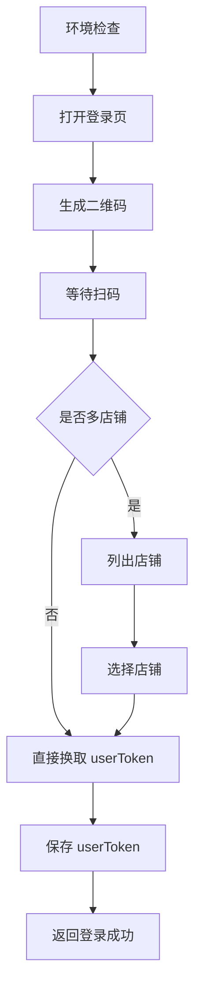

# 登录能力

## 作用

登录是所有开放能力的前置条件。

任何需要调用易奢堂开放 API 的能力，在真正执行前都必须先完成：

1. 扫码登录
2. 选店
3. 获取最终 `userToken`

## workflow

1. 环境检查
2. 打开登录页并生成二维码
3. 等待用户扫码
4. 如存在多店铺，列出店铺并选店
5. 保存最终 `userToken`
6. 返回当前登录状态

## flow

### Step 1: 环境检查

- 确认本地 Node、npm、jq、Playwright 和 Chromium 可用
- 如果依赖缺失，先执行 `./scripts/install-check.sh`

### Step 2: 打开登录页并生成二维码

- 使用 `./scripts/login.sh` 或 `./scripts/tool-call.sh login_flow`
- 调用登录二维码工具后，先读取返回的 `qrcodePath` 或 `img`
- agent 不得假定原始二维码路径一定能在当前聊天宿主中直接显示
- agent 必须先把二维码图片复制到当前工作区中的稳定位置，再尝试在聊天中展示该工作区副本
- 如果当前宿主不能直接显示图片，agent 必须立即提供降级方案：
  - 告诉用户工作区二维码副本路径
  - 告诉用户如何使用浏览器打开该本地副本
  - 告诉用户扫码完成后下一步做什么
- 只有在二维码已经成功提供给用户后，才进入等待扫码阶段

### Step 3: 选店并保存 `userToken`

- 如果扫码账号存在多店铺，先列出店铺并让用户选择
- 选店后换取最终 `userToken`
- 保存后才算登录完成

### Step 4: 返回当前登录状态

- 使用 `./scripts/status.sh` 或 `./scripts/user-token.sh` 查看当前状态

## 二维码展示与降级规则

- 二维码属于登录能力的关键输入媒介，agent 必须确保用户能真正拿到可扫描的二维码
- agent 不得只返回工具原始输出中的 `qrcodePath`，然后假定聊天宿主一定能直接渲染该图片
- agent 必须自行把二维码复制到当前工作区中的稳定位置；工作区副本路径由 agent 自行决定，但必须满足：
  - 位于当前工作区
  - 路径稳定
  - 可重复覆盖，避免引用旧二维码
- agent 应优先在聊天中展示工作区二维码副本，而不是直接依赖原始路径
- 如果聊天中无法直接展示二维码图片，agent 必须立即进入降级流程，且不能中断登录引导

### 降级方案要求

- 降级方案至少必须包含以下信息：
  - 工作区二维码副本路径
  - 浏览器打开方案
  - 扫码后的下一步提示
- 浏览器打开方案是登录能力的必备兜底项，不能省略
- agent 应根据当前系统给出对应的本地打开方式，例如：
  - macOS：`open <工作区二维码路径>`
  - Linux：`xdg-open <工作区二维码路径>`
  - Windows：`start "" <工作区二维码路径>`
- 如果 agent 当前可以直接在宿主环境中帮用户打开本地二维码副本，也可以直接执行；如果不能直接执行，必须把可执行方案明确告诉用户
- 当二维码无法直接展示时，agent 不能只说“图片在某个路径”，而必须明确说明：
  - 二维码已经复制到哪里
  - 如何通过浏览器或系统默认查看器打开
  - 扫码完成后让用户回复什么以继续流程

### 流程图



## 参数规则

### `userToken`

- 必填
- 用途：
  - 后续所有 BFF 业务接口调用的登录凭证
- 获取方式：
  - 扫码登录后，如果只有一个店铺，直接换取并保存
  - 如果存在多店铺，必须先选店，再换取并保存
- 校验规则：
  - 必须通过 `./scripts/user-token.sh` 或 `./scripts/tool-call.sh get_user_token` 读取到有效值
  - 未完成选店时，登录态不算最终完成

## 本地脚本

```bash
./scripts/login.sh
./scripts/status.sh
./scripts/user-token.sh
```

## 硬规则

- 未登录时，不得继续读取业务能力的接口串联流程并假定可以执行
- 不得猜测 `userToken`
- 未完成选店时，登录态不算最终完成
- 二维码生成后，agent 必须先确保用户能看到或打开二维码，再进入等待扫码阶段
