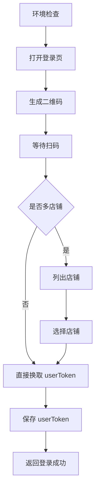

# 登录能力

## 作用

登录是所有开放能力的前置条件。

任何需要调用易奢堂开放 API 的能力，在真正执行前都必须先完成：

1. 扫码登录
2. 选店
3. 获取最终 `userToken`

## workflow

1. 环境检查
2. 获取登录二维码
3. 等待用户扫码并检查当前阶段
4. 如进入待选店阶段，读取店铺候选
5. 选择店铺并换取最终 `userToken`
6. 校验登录完成
7. 返回当前登录状态

## flow

### Step 1: 环境检查

- 确认本地 Node、npm、jq、Playwright 和 Chromium 可用
- 如果依赖缺失，先执行 `./scripts/install-check.sh`
- 推荐先使用工具 `tool.get_integration_status`
- 如果环境未就绪，不要继续执行登录二维码、状态检查、选店或读取 `userToken`

### Step 2: 获取登录二维码

- 使用工具 `tool.get_login_qrcode`
- `tool.get_login_qrcode` 的作用是：
  - 启动二维码后台等待流程
  - 返回二维码图片
  - 返回当前阶段，通常是 `waiting_for_scan`
- 工具返回后，先读取返回中的：
  - `status`
  - `statusText`
  - `qrcodePath`
  - `img`
- agent 不得假定原始二维码路径一定能在当前聊天宿主中直接显示
- agent 必须先把二维码图片复制到当前工作区中的稳定位置，再尝试在聊天中展示该工作区副本
- 如果当前宿主不能直接显示图片，agent 必须立即提供降级方案：
  - 告诉用户工作区二维码副本路径
  - 告诉用户如何使用浏览器打开该本地副本
  - 告诉用户扫码完成后下一步做什么
- 只有在二维码已经成功提供给用户后，才进入等待扫码阶段

### Step 3: 等待用户扫码并检查当前阶段

- 在二维码已经提供给用户后，使用工具 `tool.check_login_status` 或 `tool.login_flow` 检查登录流程进入到哪一阶段
- 如果返回 `waiting_for_scan`：
  - 说明二维码已生成，但用户尚未完成扫码
  - 此时不要进入选店或读取最终 `userToken`
- 如果返回 `waiting_for_shop_selection`：
  - 说明用户已扫码成功，但还没有选店
  - 此时进入 Step 4
- 如果返回 `logged_in`：
  - 说明已经拿到最终登录态
  - 可以直接进入 Step 6
- 如果返回 `logged_out`、`timed_out` 或 `error`：
  - 说明当前登录流程不可继续
  - 必须向用户说明当前阶段并决定是否重新获取二维码

### Step 4: 如进入待选店阶段，读取店铺候选

- 当 Step 3 返回 `waiting_for_shop_selection` 时，使用工具 `tool.list_shops`
- `tool.list_shops` 的作用是：
  - 读取扫码账号下可选的店铺列表
  - 返回可供用户确认的候选店铺
- 候选店铺至少会包含：
  - `index`
  - `accountUserId`
  - `enterpriseNo`
  - `name`
- 如果只有一个候选店铺，也不能跳过选店动作；必须明确按该候选继续
- 如果存在多个候选店铺：
  - 必须让用户确认要进入哪一个店铺
  - 如果当前 agent 支持 UI 选择框，必须优先使用 UI 选择框
  - 如果不支持 UI 选择框，但支持内置 HTML 表单，必须使用内置 HTML 表单
  - 只有 UI 选择框和内置 HTML 表单都不支持时，才退回文本列举候选项

### Step 5: 选择店铺并换取最终 `userToken`

- 用户确认店铺后，使用工具 `tool.select_shop`
- `tool.select_shop` 支持以下任一种入参完成选店：
  - `account_user_id`
  - `shop_index`
  - `enterprise_no`
- `tool.select_shop` 的作用是：
  - 以扫码得到的临时登录态为前提，选中具体店铺
  - 换取最终 `userToken`
  - 保存最终登录态
- 只有 `tool.select_shop` 成功后，登录流程才算进入最终完成态

### Step 6: 校验登录完成

- 使用工具 `tool.get_user_token` 校验是否已经拿到最终 `userToken`
- 如果需要同时返回当前阶段，也可以使用工具 `tool.check_login_status`
- 校验通过的标准是：
  - 能读取到有效 `userToken`
  - 当前状态为 `logged_in`
- 如果仍然是 `waiting_for_shop_selection`：
  - 说明扫码已完成，但最终选店未完成
  - 不能把当前状态当作登录完成

### Step 7: 返回当前登录状态

- 返回登录阶段、中文状态、是否已拿到最终 `userToken`
- 推荐使用：
  - 工具 `tool.check_login_status` 查看当前阶段
  - 工具 `tool.get_user_token` 查看最终 `userToken`

## 二维码展示与降级规则

- 二维码属于登录能力的关键输入媒介，agent 必须确保用户能真正拿到可扫描的二维码
- agent 不得只返回工具原始输出中的 `qrcodePath`，然后假定聊天宿主一定能直接渲染该图片
- agent 必须自行把二维码复制到当前工作区中的稳定位置；工作区副本路径由 agent 自行决定，但必须满足：
  - 位于当前工作区
  - 路径稳定
  - 可重复覆盖，避免引用旧二维码
- agent 应优先在聊天中展示工作区二维码副本，而不是直接依赖原始路径
- 如果聊天中无法直接展示二维码图片，agent 必须立即进入降级流程，且不能中断登录引导

### 降级方案要求

- 降级方案至少必须包含以下信息：
  - 工作区二维码副本路径
  - 浏览器打开方案
  - 扫码后的下一步提示
- 浏览器打开方案是登录能力的必备兜底项，不能省略
- agent 应根据当前系统给出对应的本地打开方式，例如：
  - macOS：`open <工作区二维码路径>`
  - Linux：`xdg-open <工作区二维码路径>`
  - Windows：`start "" <工作区二维码路径>`
- 如果 agent 当前可以直接在宿主环境中帮用户打开本地二维码副本，也可以直接执行；如果不能直接执行，必须把可执行方案明确告诉用户
- 当二维码无法直接展示时，agent 不能只说“图片在某个路径”，而必须明确说明：
  - 二维码已经复制到哪里
  - 如何通过浏览器或系统默认查看器打开
  - 扫码完成后让用户回复什么以继续流程

### 流程图



## 参数规则

### `userToken`

- 必填
- 用途：
  - 后续所有 BFF 业务接口调用的登录凭证
- 获取方式：
  - 扫码登录后，如果只有一个店铺，直接换取并保存
  - 如果存在多店铺，必须先选店，再换取并保存
- 校验规则：
  - 必须通过 `./scripts/user-token.sh` 或 `./scripts/tool-call.sh get_user_token` 读取到有效值
  - 未完成选店时，登录态不算最终完成

## 状态转移规则

### `waiting_for_scan`

- 表示二维码已经生成，当前仍在等待用户扫码
- 这个阶段只能继续等待扫码或重新生成二维码
- 不能直接列店铺
- 不能直接读取最终 `userToken`

### `waiting_for_shop_selection`

- 表示用户已经扫码成功，但当前账号存在需要确认的店铺
- 这个阶段必须先使用工具 `tool.list_shops` 读取候选店铺
- 用户确认后，再使用工具 `tool.select_shop`
- 在完成选店前，不得把当前状态当作登录完成

### `logged_in`

- 表示已经完成选店并换取到最终 `userToken`
- 这个阶段才允许进入其他开放能力

### `logged_out`

- 表示当前没有可用的最终登录态
- 必须重新开始二维码登录流程

### `timed_out`

- 表示二维码已过期
- 必须重新获取二维码

### `error`

- 表示登录流程或状态检查失败
- 必须先向用户说明错误，再决定是否重新开始登录流程

## 工具定义

### `tool.get_integration_status`

- 作用：
  - 检查环境依赖和当前登录集成状态
- 推荐调用：

```bash
./scripts/tool-call.sh get_integration_status
```

- 结果使用规则：
  - 如果环境未就绪，不要继续后续登录步骤

### `tool.get_login_qrcode`

- 作用：
  - 获取二维码并启动后台等待扫码流程
- 推荐调用：

```bash
./scripts/tool-call.sh get_login_qrcode
```

- 入参：
  - 可选 `timeout_seconds`
- 出参重点：
  - `status`
  - `statusText`
  - `qrcodePath`
  - `img`
- 结果使用规则：
  - 读取二维码后，先完成展示或降级展示，再等待用户扫码

### `tool.login_flow`

- 作用：
  - 对话式登录流程入口，自动判断当前应进入扫码、选店还是直接完成
- 推荐调用：

```bash
./scripts/tool-call.sh login_flow
```

- 结果使用规则：
  - 如果返回 `waiting_for_scan`，按二维码流程继续
  - 如果返回 `waiting_for_shop_selection`，进入店铺候选确认
  - 如果返回 `logged_in`，说明登录已完成

### `tool.check_login_status`

- 作用：
  - 检查当前登录阶段
- 推荐调用：

```bash
./scripts/tool-call.sh check_login_status
```

- 出参重点：
  - `status`
  - `statusText`
  - `isLoggedIn`
- 结果使用规则：
  - 用于判断当前是待扫码、待选店、已登录还是已失效

### `tool.list_shops`

- 作用：
  - 读取扫码成功后的店铺候选列表
- 推荐调用：

```bash
./scripts/tool-call.sh list_shops
```

- 出参重点：
  - `shops[].index`
  - `shops[].accountUserId`
  - `shops[].enterpriseNo`
  - `shops[].name`
- 结果使用规则：
  - 把返回结果作为用户选店候选
  - 未确认候选前，不得继续调用 `tool.select_shop`

### `tool.select_shop`

- 作用：
  - 根据用户确认的店铺，换取最终 `userToken`
- 推荐调用示例：

```bash
./scripts/tool-call.sh select_shop '{"shop_index":1}'
```

```bash
./scripts/tool-call.sh select_shop '{"account_user_id":12345}'
```

```bash
./scripts/tool-call.sh select_shop '{"enterprise_no":"SAAS20240920889475"}'
```

- 入参：
  - `shop_index` 或 `account_user_id` 或 `enterprise_no`
- 结果使用规则：
  - 只有成功后，才能认为已完成最终选店和换 token

### `tool.get_user_token`

- 作用：
  - 读取已保存的最终 `userToken`
- 推荐调用：

```bash
./scripts/tool-call.sh get_user_token
```

- 结果使用规则：
  - 能读取到有效 `userToken` 才算登录最终完成
  - 读取失败时，要结合 `tool.check_login_status` 判断当前是待扫码、待选店还是已失效

## 本地脚本

```bash
./scripts/login.sh
./scripts/status.sh
./scripts/user-token.sh
```

## 硬规则

- 未登录时，不得继续读取业务能力的接口串联流程并假定可以执行
- 不得猜测 `userToken`
- 未完成选店时，登录态不算最终完成
- 二维码生成后，agent 必须先确保用户能看到或打开二维码，再进入等待扫码阶段
